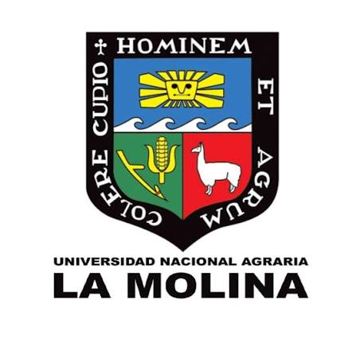

<h1 align="center">

 
Jose Luis Garay Ramos
</h1>

<h3 align="center">

</h3>

## 

Soy estudiante de **Estadística** en la **Universidad Nacional Agraria La Molina (UNALM)**.

Me dedico a explorar y entender qué historias esconden los datos, combinando el rigor matemático de la estadística con herramientas modernas de **Data Science, Machine Learning e Inteligencia Artificial**.

Más que solo escribir código, mi enfoque está en la **resolución de problemas complejos mediante datos**.

Disfruto coordinando grupos de investigación en mi facultad, donde llevamos la estadística teórica hacia aplicaciones reales:

  
  
  
  
  

 

---

<h2 align="center"></h2>

---

<h2 align="center"></h2>

---

<h2 align="center"></h2>

Como estudiante de la **Universidad Nacional Agraria La Molina**, he consolidado una formación analítica basada en estadística aplicada, programación y ciencia de datos.

<table align="center">

<tr>
<td width="50%">

### 

Dominio de técnicas como:

- MANOVA.
- PCA (Análisis de Componentes Principales).
- Análisis Factorial.
- Reducción de dimensionalidad.

</td>

<td width="50%">

### 

Aplicación de:

- Pruebas estadísticas.
- Métodos basados en rangos.
- Métricas avanzadas de distancia.

</td>

</tr>

<tr>

<td>

### 

Modelamiento y extracción de información en datos que evolucionan continuamente.

</td>

<td>

### 

Experiencia académica en:

- Lenguaje de Programación II.
- Bases de Datos I.
- Arquitectura de datos.
- Consultas SQL.

</td>

</tr>

</table>

---

<h2 align="center"></h2>

## 

Proyecto de **Machine Learning aplicado a telecomunicaciones** para identificar clientes con riesgo de abandono.

Tecnologías:

  
  
  
  
  
  
  

---

## 

Plataforma **Full-Stack inteligente** para monitorear estudiantes en riesgo académico mediante:

  
  

Tecnologías:

- PHP
- MySQL
- Vue.js
- Bootstrap
- Chart.js

---

## 

Construcción de soluciones analíticas mediante:

  
  
  

Herramientas:

- Power BI
- DAX
- Power Query
- Excel

---

## 

Desarrollo de proyectos relacionados con:

- Análisis Multivariado.
- MANOVA.
- Modelos lineales.
- Diseños experimentales:
  - DBCA.
  - Diseños factoriales.
- Análisis turístico.
- Estudios aplicados en producción agropecuaria.

Herramientas:

- R.
- Python.

---

## 

Aplicación de técnicas de aprendizaje automático:

  
  
  
  

Modelos utilizados:

- Scikit-Learn.
- XGBoost.
- Random Forest.
- Regresión Logística.
- Validación de modelos.

---

## 

Experiencia en:

  
  
  

Tecnologías:

- MySQL.
- SQL Server.
- Microsoft Azure for Students.

---

## 

Desarrollo de soluciones basadas en datos e inteligencia artificial para resolver problemas reales.

Proyecto enfocado en innovación y análisis de datos, obteniendo reconocimiento dentro del programa.

---

<h2 align="center"></h2>

 

  
 
Estudiante activo en El Británico.

---
