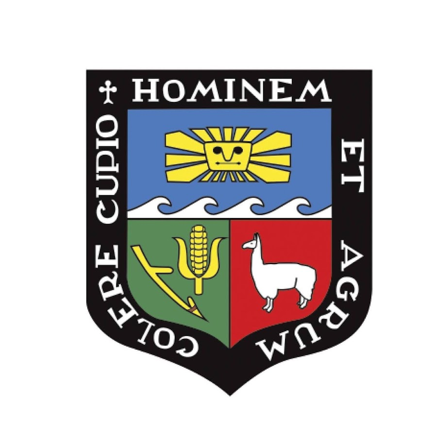

# ¡Hola! 👋 Soy Jose Luis Garay Ramos

Soy estudiante de **Estadística** en la [Universidad Nacional Agraria La Molina (UNALM)](#), radicando en Lima, Perú. Soy un apasionado por extraer valor de los datos a través del **Data Science** y el **Machine Learning**. 

Mi enfoque principal es la aplicación de modelos estadísticos avanzados y la programación para resolver problemas complejos. Disfruto liderando grupos de investigación académica y transformando datos brutos en soluciones estratégicas, desde el análisis estadístico puro hasta la implementación de modelos predictivos.

---

### 🌐 Conéctate Conmigo

---

### 🛠️ Dominio Técnico y Herramientas

  
  
  
  
  

---

### 📊 Mi Enfoque e Intereses

* 🎓 **Perfil Académico:** Estudiante de Estadística en la UNALM y coordinador de proyectos de investigación.
* 🧠 **Áreas de Especialidad:** Machine Learning (Random Forest, XGBoost), Análisis Multivariado (MANOVA, PCA) y Functional Data Analysis (FDA).
* 💻 **Stack Tecnológico:** Desarrollo en R, Python y exploración de infraestructura en la nube con Microsoft Azure.
* 📈 **Experiencia Práctica y Proyectos:** * Análisis comparativo del gasto turístico (Marcona vs. Paracas) aplicando estadística no paramétrica y la Distancia de Wasserstein.
  * Estudios multivariados (ej. análisis de calidad mediante modelos MANOVA).
  * Resolución de retos técnicos de código y análisis de datos de órdenes.
* 🌍 **Idiomas:** Español (Nativo) | Inglés (Nivel Pre-intermedio / B1).
